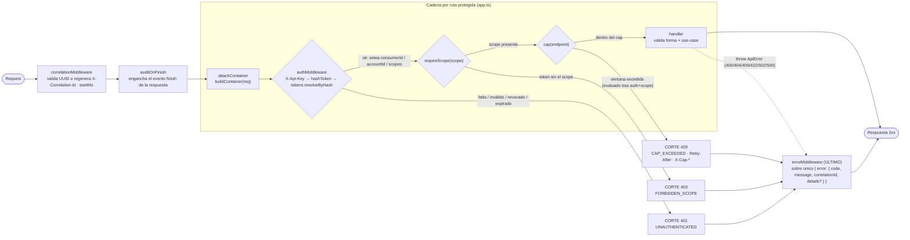
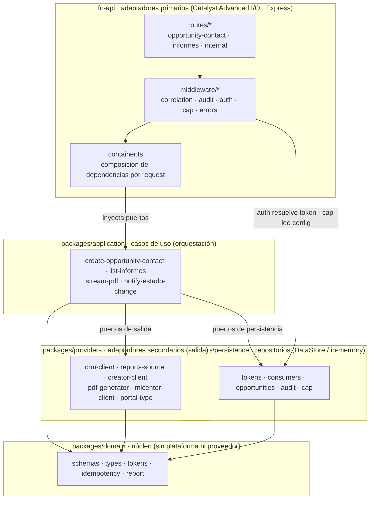
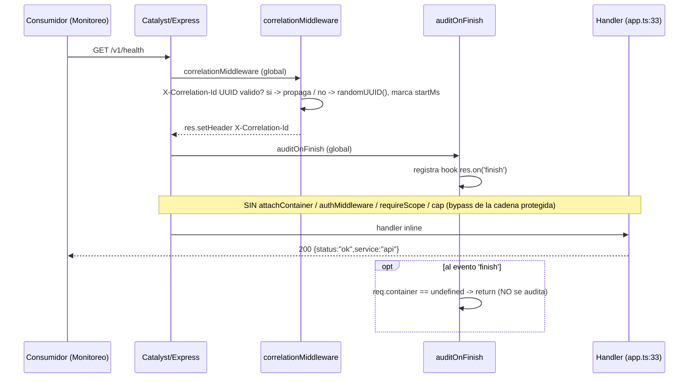
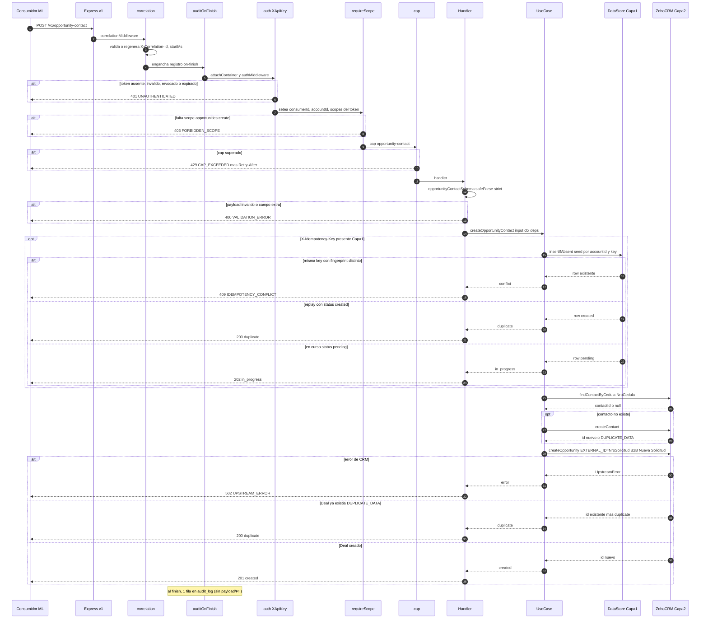
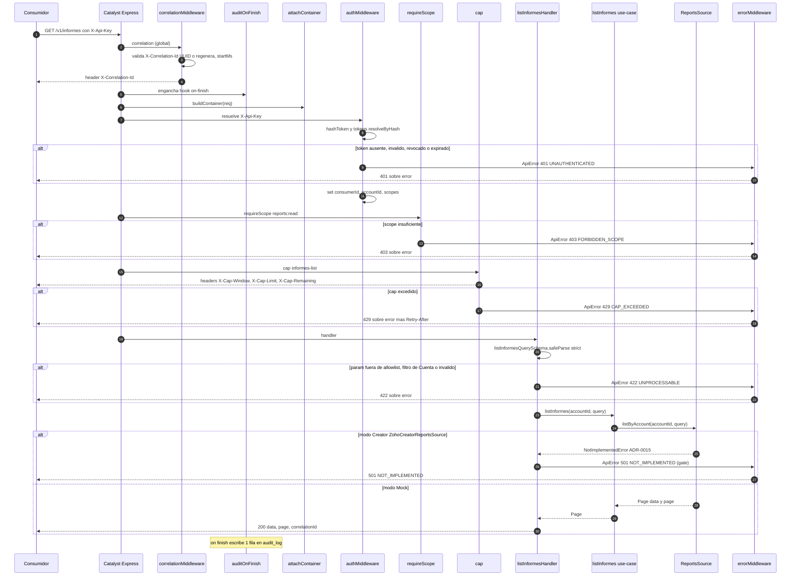
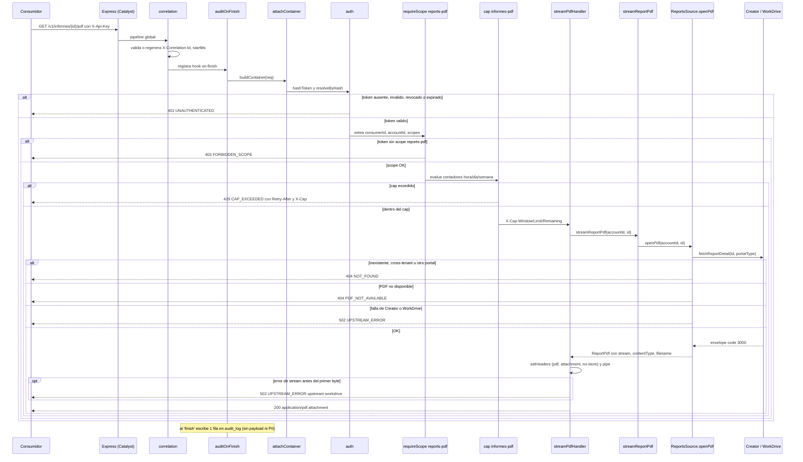
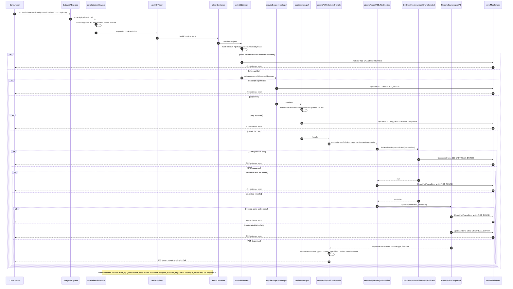
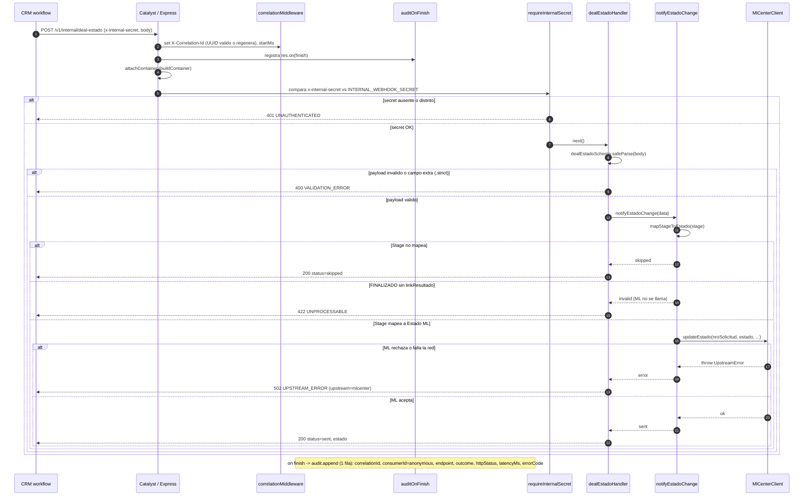

# API cardoc-ml — Documentación de Endpoints

## 1. Introducción

**cardoc-ml** es la API B2B (gateway) que expone a las automotoras un contrato estable `/v1/*` sobre el ecosistema Zoho: crea Oportunidades y Contactos en **Zoho CRM** y sirve los Informes de Revisión (metadata + PDF) desde **Zoho Creator / WorkDrive**, sin filtrar jamás URLs internas, `fileId` ni PII del upstream.

Corre sobre **Catalyst Advanced I/O** (función Node.js con Express) y está construida con **arquitectura hexagonal**: el núcleo de dominio (`@cardoc/domain`) no conoce ni la plataforma ni los proveedores; los casos de uso (`@cardoc/application`) orquestan contra puertos; y los adaptadores concretos —CRM, Creator, PDF, ML, DataStore— viven en el borde (`@cardoc/providers`, `@cardoc/persistence`) y se inyectan por request desde `container.ts`. Esto mantiene el reemplazo de un proveedor (o del modo de persistencia) como un cambio de borde, no de núcleo.

**Base URL (dev):** `https://ml-909785950.development.catalystserverless.com/server/api`
Todas las rutas cuelgan del prefijo `/v1/*` (p. ej. `.../server/api/v1/opportunity-contact`).

> **Autenticación — leer primero:** el token del consumidor viaja en el header propio **`X-Api-Key`**, **no** en `Authorization`. Catalyst reserva `Authorization` y lo valida como token OAuth de Zoho, rechazando cualquier otro valor con `INVALID_TOKEN` antes de que la request llegue a nuestro código.

Endpoints públicos protegidos:

| Método | Ruta | Función |
|---|---|---|
| `POST` | `/v1/opportunity-contact` | Crea/reutiliza Contacto + crea Oportunidad (`Nueva Solicitud`, server-side). Idempotente por `NroSolicitud`. |
| `GET` | `/v1/informes` | Lista Informes de Revisión de la Cuenta autenticada (filtros allowlist + cursor opaco). |
| `GET` | `/v1/informes/:id/pdf` | Stream autenticado del PDF por id interno de Creator. |
| `GET` | `/v1/informes/solicitud/:nroSolicitud/pdf` | Variante del stream que resuelve el Análisis por N.º de Solicitud externo vía CRM. |

Rutas fuera del contrato público: `GET /v1/health` (abierta, sin auth, para monitoreo) y `POST /v1/internal/deal-estado` (CRM → Catalyst, protegida por **shared-secret** `x-internal-secret`, sin scopes ni `X-Api-Key`).

---

## 2. Pipeline de middlewares (orden fijo)

El orden está fijado en `app.ts` y es innegociable. Dos middlewares son **globales** (corren en toda request, incluida `/v1/health`); la **cadena por ruta protegida** se monta explícitamente en cada ruta —no por prefijo— porque `/v1/informes` y `/v1/informes/:id/pdf` tienen scopes y caps distintos. El `errorMiddleware` va **último** y traduce todo al sobre único.



Notas de comportamiento (código real):

- **`correlationMiddleware`** (global): toma `X-Correlation-Id` entrante si es UUID válido, si no lo regenera; marca `startMs`; devuelve el id en el header de respuesta.
- **`auditOnFinish`** (global): sobre `res.on("finish")` registra **exactamente 1 fila** en `audit_log` con `correlationId / consumerId / accountId / endpoint / outcome / httpStatus / latencyMs / errorCode`. Aplica tanto a respuestas 2xx como de error, y **nunca** loguea payload ni PII. Requiere `container` adjunto (por eso `/v1/health` no se audita).
- **`attachContainer`**: compone repos + adapters para la request (`buildContainer`); si falla → 500 `INTERNAL_ERROR`.
- **`authMiddleware`**: hashea el `X-Api-Key`, resuelve `consumerId / accountId / scopes` desde `api_tokens`. **El tenant nunca viene del payload/query.** Corta con **401** si el header falta o el token es inválido/revocado/expirado.
- **`requireScope(scope)`**: corta con **403** `FORBIDDEN_SCOPE` (`details.required = <scope>`) si el token no lo posee.
- **`cap(endpoint)`**: se evalúa **después** de auth+scope (un 401/403 no consume cap). Setea siempre `X-Cap-Window / X-Cap-Limit / X-Cap-Remaining`; al exceder, agrega `Retry-After` y corta con **429**.
- **`errorMiddleware`**: si `headersSent` (p. ej. el PDF ya empezó a streamear) delega en `next(err)`; si no, emite el sobre único y marca `errorCode` para la auditoría.

---

## 3. Scopes y Caps

### 3.1 Scopes

Un scope por capacidad; el token puede tener uno o varios. `type Scope` en `packages/domain/src/types.ts`.

| Scope | Endpoint(s) | Habilita |
|---|---|---|
| `opportunities:create` | `POST /v1/opportunity-contact` | Crear Contacto + Oportunidad en CRM. |
| `reports:read` | `GET /v1/informes` | Listar Informes de Revisión de la Cuenta. |
| `reports:pdf` | `GET /v1/informes/:id/pdf` · `GET /v1/informes/solicitud/:nroSolicitud/pdf` | Descargar/streamear el PDF del informe. |

### 3.2 Caps

Rate-limit por **consumidor + endpoint** en 3 ventanas (`hour` / `day` / `week`), config en `consumer_caps`; sin fila para el consumidor → se aplican los defaults de env. Contadores in-memory por contenedor caliente (gate de plataforma pendiente: Catalyst Cache para cap distribuido). El endpoint `cap()` recibe un **label lógico**, no el path.

**Defaults de entorno** (`CARDOC_CAP_DEFAULT_*`): `hour` = 1000 · `day` = 10000 · `week` = 50000.

**Valores acordados con Cardoc (§10 D6, 2026-07-02) para `consumer_ml`** — solo se fija la ventana horaria; día/semana quedan en defaults como guardrail:

| Endpoint (label) | Ruta | hour | day | week |
|---|---|---|---|---|
| `opportunity-contact` | `POST /v1/opportunity-contact` | **60** | 10000 (default) | 50000 (default) |
| `informes-list` | `GET /v1/informes` | **120** | 10000 (default) | 50000 (default) |
| `informes-pdf` | `GET /v1/informes/:id/pdf` y `/solicitud/:nroSolicitud/pdf` | **100** | 10000 (default) | 50000 (default) |

Al exceder cualquier ventana: `429 CAP_EXCEEDED` con `Retry-After` (segundos al reset más cercano) y `details.{ window, limit, retryAfterSeconds }`. Una ventana con límite `null` se omite (sin tope).

---

## 4. Catálogo de errores

Todos los errores salen en el **sobre único** `{ error: { code, message, correlationId, details? } }`. `code` es un `ErrorCode` estable, independiente del HTTP status (`middleware/errors.ts`).

| HTTP | `code` (ErrorCode) | Cuándo se produce |
|---|---|---|
| 400 | `VALIDATION_ERROR` | Body inválido en `POST /v1/opportunity-contact` (`opportunityContactSchema` falla). `details.fields`. |
| 401 | `UNAUTHENTICATED` | Falta `X-Api-Key`, o token inválido/revocado/expirado. También `x-internal-secret` inválido en la ruta interna. |
| 403 | `FORBIDDEN_SCOPE` | El token no incluye el scope requerido por la ruta. `details.required`. |
| 404 | `NOT_FOUND` | Informe inexistente **o de otra Cuenta** (tenancy verificada antes de responder). |
| 404 | `PDF_NOT_AVAILABLE` | El informe existe pero su PDF aún no está disponible. `details.informeId`. |
| 409 | `IDEMPOTENCY_CONFLICT` | Mismo `NroSolicitud` reenviado con un payload distinto. `details.nroSolicitud`. |
| 422 | `UNPROCESSABLE` | Query params fuera de la allowlist en `GET /v1/informes` (`listInformesQuerySchema` es `.strict()`). `details.fields`. |
| 429 | `CAP_EXCEEDED` | Cap por ventana superado. Headers `Retry-After` + `X-Cap-*`; `details.{ window, limit, retryAfterSeconds }`. |
| 501 | `NOT_IMPLEMENTED` | `GET /v1/informes` en modo Creator: el listado por pull está descartado (ADR-0015; ML es push). Gateado limpio, no un 500. |
| 502 | `UPSTREAM_ERROR` | Fallo del sistema upstream (CRM / Creator / WorkDrive), o el stream del PDF falla **antes del primer byte**. `details.upstream` = etiqueta opaca (`crm` \| `creator` \| `workdrive`). |
| 500 | `INTERNAL_ERROR` | Error no controlado o `container init failed`. Sin detalle interno. |

---

## 5. Arquitectura hexagonal

`fn-api` (adaptadores primarios: rutas + middleware) compone dependencias en `container.ts` e invoca los casos de uso de `@cardoc/application`. Los use-cases dependen solo del núcleo `@cardoc/domain` y de **puertos** implementados por los adaptadores secundarios de `@cardoc/providers` (salida a CRM/Creator/PDF/ML) y `@cardoc/persistence` (repositorios). El dominio no importa a nadie del borde.



Regla de dependencia: las flechas apuntan hacia el núcleo. Cambiar de `MockCrmClient` a `ZohoCrmClient`, o de persistencia in-memory a DataStore, es una decisión de composición en `container.ts` (flags `CARDOC_CRM_MODE`, `CARDOC_REPORTS_MODE`, `CARDOC_PERSISTENCE`) — el dominio y los casos de uso no se tocan.

---

## GET /v1/health

Health check abierto que consume el monitoreo de disponibilidad; responde siempre `200 {status:"ok",service:"api"}`.

**Auth:** Ninguna — endpoint abierto (sin `attachContainer`, sin `authMiddleware`) | **Scope:** — (ninguno) | **Cap (label):** — (sin cap) | **Handler:** `apps/catalyst/functions/api/src/app.ts:33` (handler inline, no delega a ruta ni use-case) · **Use-case:** — (ninguno)

### Request

- **Headers**

| Header | Oblig. | Propósito |
|---|---|---|
| `X-Correlation-Id` | No | Opcional. Si llega y matchea el patrón UUID (`UUID_RE`, `auth.ts:27`) se propaga tal cual; si falta o es inválido se regenera con `randomUUID()`. La respuesta **siempre** trae `X-Correlation-Id` (seteado por `correlationMiddleware`, `auth.ts:35`). No requiere `X-Api-Key`. |

- **Path/Query params**: no aplica.
- **Body**: no aplica (es un `GET`; el handler ignora el `req` — está tipado como `_req`).

### Response

- **Éxito**: `200 OK`

```json
{ "status": "ok", "service": "api" }
```

  Además, la respuesta incluye el header `X-Correlation-Id` (agregado por el middleware global de correlación).

- **Errores**: N/A. El handler es una única línea que responde `200` incondicionalmente; no hay validación, auth, scope ni cap que puedan cortar. El `errorMiddleware` global existe (montado último, `app.ts:83`) pero este endpoint nunca lanza, así que ningún código del `ErrorCode` enum es alcanzable por esta ruta.

### Secuencia



### Notas

- **Único endpoint fuera de la cadena protegida.** Se monta directo tras los dos middlewares globales (`app.ts:29-30`), antes de definir `const authed = [attachContainer, authMiddleware]` (`app.ts:38`). Por eso no pasa por auth/scope/cap: el orden de registro en Express es lo que lo deja abierto (`app.ts:32-35`).
- **No se audita pese al `auditOnFinish` global.** El middleware corre para todas las rutas, pero en el hook `res.on("finish")` hace `if (!container) return` (`audit.ts:16-19`). Como `/v1/health` nunca ejecuta `attachContainer`, `req.container` es `undefined` y no se escribe fila en `audit_log`. El comentario del código lo dice explícito: "/v1/health u otras rutas sin auth/container -> no se auditan" (`audit.ts:17`).
- **Sí participa de la correlación.** `correlationMiddleware` es global (`app.ts:29`) y siempre setea `req.correlationId`, `req.startMs` y el header de respuesta `X-Correlation-Id` (`auth.ts:30-36`), aunque acá `startMs` no termina usándose para latencia porque no hay auditoría.
- **Handler inline, sin capa de dominio.** A diferencia de las rutas protegidas, no hay archivo en `routes/` ni use-case en `packages/application`: la respuesta se arma en el propio `app.ts:34`.
- **Nota lateral:** existe otra ruta trivial abierta, `app.all("/", ...)` que responde `200 "cardoc api: live"` (`app.ts:78-80`); es distinta de `/v1/health` y no forma parte del contrato `/v1`.

---

## POST /v1/opportunity-contact

Crea o reutiliza un Contacto (dedup por cédula) y crea una Oportunidad en stage `Nueva Solicitud` del pipeline `B2B` en Zoho CRM, a partir del payload plano PascalCase que manda ML/AutoCheck.

**Auth:** `X-Api-Key` (token del consumidor; Catalyst reserva `Authorization`) | **Scope:** `opportunities:create` | **Cap (label):** `opportunity-contact` | **Handler:** `apps/catalyst/functions/api/src/routes/opportunity-contact.ts:13` · **Use-case:** `createOpportunityContact` (`packages/application/src/create-opportunity-contact.ts:53`)

### Request

- **Headers**

| Header | Oblig. | Propósito |
|---|---|---|
| `X-Api-Key` | Sí | Token del consumidor; se hashea y se resuelve a `consumerId`/`accountId`/`scopes` (`auth.ts:58`). NO usar `Authorization` (Catalyst lo reserva para OAuth Zoho). |
| `Content-Type: application/json` | Sí | El body se parsea con `express.json()` (`app.ts:28`). |
| `X-Correlation-Id` | No | UUID de correlación; si falta o no matchea el regex UUID se regenera y se devuelve en la respuesta (`auth.ts:30-37`). |
| `X-Idempotency-Key` | No | Si viene (no vacío), activa la idempotencia de **Capa 1** en el DataStore antes de tocar Zoho (`routes/opportunity-contact.ts:31-33`). Sin él, la dedup la hace solo el CRM (Capa 2). |

- **Body** — validado por `opportunityContactSchema` (`packages/domain/src/schemas.ts:19-54`), en modo `.strict()`: **cualquier campo desconocido → 400 VALIDATION_ERROR** (`schemas.ts:36`). Nombres exactos (PascalCase) que se aceptan:

| Campo | Tipo | Oblig. | Notas |
|---|---|---|---|
| `NroCedula` | number (`z.coerce.number().int().positive()`) | Sí | Llave de dedup del Contacto → Zoho `Cedula` (campo TEXT). |
| `NroSolicitud` | number (`z.coerce.number().int().positive()`) | Sí | External ID del Deal (`EXTERNAL_ID`) y clave de dedup de Capa 2. |
| `Nombres` | string, 1–100 | Sí | → `First_Name`. |
| `Apellidos` | string, 1–100 | Sí | → `Last_Name` (único system_mandatory del Contacto). |
| `CelularCliente` | string, ≤30 | No | → `Mobile` (este CRM no tiene `Phone`). |
| `Tenant` | string, ≤100 | No | Informativo → `nota_agenda`. NO define la Cuenta (siempre es la Cuenta "ML" del token). |
| `Sucursal` | string, ≤100 | No | → `nota_agenda`. |
| `DepartamentoSucursal` | string, ≤100 | No | → `nota_agenda`. |
| `CiudadSucursal` | string, ≤100 | No | → `nota_agenda`. |
| `DireccionSucursal` | string, ≤200 | No | → `nota_agenda`. |
| `MarcaVehiculo` | string, ≤100 | No | → `nota_agenda`. |
| `ModeloVehiculo` | string, ≤100 | No | → `nota_agenda`. |
| `AnioVehiculo` | number (`z.coerce.number().int()`) | No | → `nota_agenda`. |
| `MatriculaVehiculo` | string, ≤30 | No | → `nota_agenda`. |

> El `accountId` (Cuenta "ML") sale SIEMPRE del token resuelto, nunca del body (`routes/opportunity-contact.ts:22`, `create-opportunity-contact.ts:24`). El schema transforma estos campos a la forma camelCase del dominio `OpportunityContactInput` (`schemas.ts:37-53`).

### Response

- **Éxito** — el handler traduce el `outcome.status` del use-case a HTTP (`routes/opportunity-contact.ts:40-71`):

**201 Created** (Oportunidad nueva):
```json
{
  "status": "created",
  "correlationId": "…",
  "nroSolicitud": 987654,
  "contact":     { "id": "c... ", "reused": false },
  "opportunity": { "id": "opp...", "stage": "Nueva Solicitud" }
}
```

**200 OK** (`duplicate`: el Deal ya existía en CRM por `EXTERNAL_ID`, o replay de una key de Capa 1 ya `created`):
```json
{
  "status": "duplicate",
  "correlationId": "…",
  "nroSolicitud": 987654,
  "contact":     { "id": "c..." },
  "opportunity": { "id": "opp...", "stage": "Nueva Solicitud" }
}
```

**202 Accepted** (`in_progress`: existe una fila de Capa 1 en estado `pending` — otro request con la misma `X-Idempotency-Key` está en vuelo):
```json
{ "status": "in_progress", "correlationId": "…", "nroSolicitud": 987654 }
```

> `contact.reused` (bool) sólo aparece en la respuesta 201. En 200 `duplicate` sólo se devuelve `contact.id`. El `stage` siempre es `"Nueva Solicitud"` (`FIXED_OPPORTUNITY_STAGE`), fijado server-side.

- **Errores** — sobre único `{ error: { code, message, correlationId, details? } }` (`errors.ts:81-88`). Códigos del `ErrorCode` enum reales para este endpoint:

| HTTP | code | Cuándo |
|---|---|---|
| 400 | `VALIDATION_ERROR` | Body no pasa `opportunityContactSchema` (campo faltante, tipo inválido, o campo extra por `.strict()`). `details.fields` = errores por campo (`routes/opportunity-contact.ts:15-19`). |
| 401 | `UNAUTHENTICATED` | Falta `X-Api-Key`, o token inválido/revocado/expirado (`auth.ts:60-76`). |
| 403 | `FORBIDDEN_SCOPE` | El token no tiene `opportunities:create` (`auth.ts:88-96`). |
| 409 | `IDEMPOTENCY_CONFLICT` | Misma `X-Idempotency-Key` con un payload distinto (fingerprint no coincide). `details.nroSolicitud` (`routes/opportunity-contact.ts:62-68`). |
| 429 | `CAP_EXCEEDED` | Se superó el cap del consumidor+endpoint. Setea `Retry-After` y `X-Cap-*` (`cap.ts:80-90`). |
| 502 | `UPSTREAM_ERROR` | Falla escribiendo en Zoho CRM (`details.upstream: "crm"`) (`routes/opportunity-contact.ts:69-70`). |
| 500 | `INTERNAL_ERROR` | `container`/`accountId` no resueltos tras la cadena de auth (`routes/opportunity-contact.ts:23-25`). |

> Este endpoint no emite 404/422/`PDF_NOT_AVAILABLE`/`NOT_FOUND`.

### Secuencia



### Notas

- **Idempotencia en 2 capas** (ADR-0002, `create-opportunity-contact.ts:4-14`):
  - **Capa 1 (DataStore de Catalyst)** — sólo si llega `X-Idempotency-Key`. La clave física es el **header** `X-Idempotency-Key`, NO el `NroSolicitud` (decisión Nestor 2026-06-25, `packages/domain/src/idempotency.ts:6-8`). `insertIfAbsent` siembra un row `pending`; el `payloadFingerprint` (SHA-256 canónico con claves ordenadas, `idempotency.ts:17-34`) detecta "misma clave, payload distinto" → 409. Replay ya `created` → `duplicate`; row `pending` → `in_progress`; row `error` previo → se reintenta (`create-opportunity-contact.ts:135-142`).
  - **Capa 2 (Zoho CRM)** — siempre. Contacto dedup por cédula (`findContactByCedula`); Deal por `EXTERNAL_ID` único: Zoho responde `DUPLICATE_DATA` con el id existente y el adapter lo devuelve como `duplicate`, no como error (`crm-client.ts:300-305`).
- **Ojo — comentario del route engañoso:** `routes/opportunity-contact.ts:3` dice "Idempotente por `NroSolicitud`", que refleja la Capa 2 (EXTERNAL_ID). La Capa 1 se llavea por el header, no por `NroSolicitud` (`idempotency.ts:6-8`). Sin header, no hay detección de "mismo NroSolicitud + payload distinto" — esa garantía es exclusiva de Capa 1 (`create-opportunity-contact.ts:12-13, 102-117`).
- **Consistencia entre capas:** con header, si el Deal ya existía en CRM (`DUPLICATE_DATA`) el resultado es `duplicate` aunque la key de Capa 1 sea nueva (`create-opportunity-contact.ts:150-153`).
- **Reuso de Contacto:** `reused=true` tanto si se encontró por cédula (`findContactByCedula`) como si Zoho dedupeó el `createContact` por `Cedula` único (`create-opportunity-contact.ts:65-81`).
- **Pipeline/stage server-side:** el Deal se crea con `Pipeline="B2B"` (`ZOHO_FIXED_PIPELINE`, `crm-client.ts:68`) y `Stage="Nueva Solicitud"` (`FIXED_OPPORTUNITY_STAGE`, `packages/domain/src/types.ts:57`). Ese stage pertenece al pipeline B2B, NO al `Standard` — crearlo con Standard sería inconsistente y Zoho lo rechaza (`crm-client.ts:60-67`).
- **Deals sin lookup a Accounts:** la Cuenta "ML" cuelga del Contacto (`Contacts.Account_Name`), no del Deal (`crm-client.ts:81-83`). `Tenant` del body es informativo y va a `nota_agenda`.
- **Tenancy física:** el UNIQUE del DataStore es single-column sobre `idempotency_key`; `accountId` se filtra en la query como defensa anti-cross-access (`idempotency.ts:6-8`, `packages/persistence/src/repositories.ts:32-38`).
- **Cap in-memory:** los contadores del cap son por contenedor caliente, no distribuidos; el blueprint pide Catalyst Cache antes de producción (`cap.ts:6-9`). El cap se evalúa DESPUÉS de auth+scope (401/403 no consumen cap).
- **Auditoría:** exactamente 1 fila en `audit_log` al evento `finish`, con correlationId/consumerId/accountId/endpoint/outcome/httpStatus/latencyMs/errorCode — nunca payload ni PII (`middleware/audit.ts:13-38`).
- **Envelope de error opaco:** `UpstreamError` se traduce a 502 con `details.upstream` (etiqueta opaca `"crm"`), nunca URLs ni ids internos del upstream (`middleware/errors.ts:58-61`).

---

## GET /v1/informes
Lista los Informes de Revisión de la Cuenta autenticada, con filtros controlados y paginación por cursor opaco.

**Auth:** `X-Api-Key` (token del consumidor; resuelve `consumerId`/`accountId`/`scopes`) | **Scope:** `reports:read` | **Cap (label):** `informes-list` | **Handler:** `apps/catalyst/functions/api/src/routes/informes.ts:30` (`listInformesHandler`) · **Use-case:** `listInformes` (`packages/application/src/list-informes.ts:9`)

### Request

- **Headers**

| Header | Oblig. | Propósito |
|---|---|---|
| `X-Api-Key` | Sí | Token del consumidor. Se hashea (`hashToken`) y se resuelve vía `tokens.resolveByHash`; de él salen `consumerId`, `accountId` y `scopes`. **No** se usa `Authorization` (Catalyst lo reserva para OAuth de Zoho). `auth.ts:58,71,77-79` |
| `X-Correlation-Id` | No | UUID de traza. Si falta o no es UUID válido, se regenera. Se devuelve siempre en la respuesta (`X-Correlation-Id`). `auth.ts:30-37` |

- **Query params** (allowlist REAL, `listInformesQuerySchema` con `.strict()` — `schemas.ts:62-71`)

| Param | Tipo | Oblig. | Notas |
|---|---|---|---|
| `estado` | enum `en_progreso` \| `completado` \| `cerrado` | No | Filtra por estado del informe. `estadoInformeSchema` (`schemas.ts:13`) |
| `matricula` | string | No | Filtra por matrícula (en Mock, match exacto). |
| `desde` | string | No | Fecha desde (string libre; no aplicado por el Mock). |
| `hasta` | string | No | Fecha hasta (string libre; no aplicado por el Mock). |
| `cursor` | string | No | Cursor opaco de paginación (no expone offset ni IDs internos). |
| `limit` | number (int > 0, máx 100) | No | Coaccionado desde string. Default **20** (`LIMIT_DEFAULT`), tope **100** (`LIMIT_MAX`). `schemas.ts:58-59,69` |

Cualquier parámetro fuera de esta lista (p. ej. un filtro de Cuenta como `accountId`/`cuenta`) hace fallar `.strict()` → **422 UNPROCESSABLE**. La Cuenta nunca se elige por query: sale del token (tenancy).

- **Body**: no aplica (GET).

### Response

- **Éxito**: `200 OK`, JSON normalizado `{ data[], page, correlationId }`. Cada ítem es un `InformeRevision` (`types.ts:67-76`); `page` es `{ limit, nextCursor, hasMore }` (`types.ts:90-93`); el handler agrega `correlationId` de nivel superior (`routes/informes.ts:46`).

```json
{
  "data": [
    {
      "id": "acc123-INF-001",
      "estado": "completado",
      "matricula": "ABC1234",
      "vehiculo": "VW Amarok 2018",
      "cliente": "Cliente Demo",
      "fecha": "2026-06-20",
      "pdfDisponible": true
    }
  ],
  "page": { "limit": 20, "nextCursor": null, "hasMore": false },
  "correlationId": "3f1c9d2a-1b2c-4d5e-8f90-0a1b2c3d4e5f"
}
```

- **Errores** (sobre único `{ error: { code, message, correlationId, details? } }`, `errors.ts:81-88`; solo códigos del `ErrorCode` enum, `errors.ts:13-23`)

| HTTP | code | Cuándo |
|---|---|---|
| 401 | `UNAUTHENTICATED` | Falta `X-Api-Key`, o token inválido / revocado / expirado. `auth.ts:60-76` |
| 403 | `FORBIDDEN_SCOPE` | El token no incluye `reports:read`. `auth.ts:88-96` |
| 429 | `CAP_EXCEEDED` | Cap `informes-list` superado. Devuelve `Retry-After` y `X-Cap-Window`/`X-Cap-Limit`/`X-Cap-Remaining`. `cap.ts:74-90` |
| 422 | `UNPROCESSABLE` | Query inválida: param fuera de la allowlist (`.strict()`), `estado` fuera del enum, `limit` no positivo o > 100, **o un filtro de Cuenta**. `routes/informes.ts:31-37` |
| 501 | `NOT_IMPLEMENTED` | **Modo Creator**: `listByAccount` lanza `NotImplementedError` (ADR-0015: listado por pull descartado) → el handler lo **gatea a un 501 limpio** (`routes/informes.ts:41-50`, `reports-source.ts:215-217`). Solo `MockReportsSource` devuelve datos. |
| 500 | `INTERNAL_ERROR` | `container`/`accountId` no resueltos tras la cadena de auth (`routes/informes.ts:22-26`). |

### Secuencia



### Notas

- **Tenancy blindada.** El `accountId` lo agrega el backend desde el token (`auth.ts:77-79`) y se pasa como primer argumento del use-case (`list-informes.ts:9-15`); el consumidor nunca elige Cuenta. Como refuerzo, la query usa `.strict()` (`schemas.ts:61-71`): un filtro de Cuenta u otro param desconocido es rechazado con **422 UNPROCESSABLE** en `routes/informes.ts:31-37`.
- **422, no 400.** La validación de query se hace dentro del handler con `safeParse` y lanza `ApiError(422, "UNPROCESSABLE", ...)` (`routes/informes.ts:33-37`), no `VALIDATION_ERROR`(400). El 400 queda reservado a otros flujos.
- **En modo Creator, este endpoint no responde 200.** `ZohoCreatorReportsSource.listByAccount` lanza `NotImplementedError` (ADR-0015: el listado por pull se descartó porque ML es push) — `reports-source.ts:215-217`. El handler lo **gatea a un `501 NOT_IMPLEMENTED` limpio** (`routes/informes.ts:41-50`), no un `500` genérico. **Solo `MockReportsSource` devuelve datos** (`reports-source.ts:80-90`, data de muestra), útil para dev/test.
- **Cursor decorativo hoy.** El Mock siempre responde `nextCursor: null`, `hasMore: false` (`reports-source.ts:89`); la paginación real depende de una fuente que aún no existe en modo Creator.
- **Cap in-memory, no distribuido.** Los contadores del cap viven por contenedor caliente; el blueprint pide Catalyst Cache (TTL + increment atómico) antes de producción — `cap.ts:6-9`. El cap se evalúa **después** de auth + scope (401/403 no consumen cap), `cap.ts:2-3`.
- **Auditoría on-finish.** `auditOnFinish` escribe exactamente 1 fila en `audit_log` al evento `finish` con `correlationId`/`consumerId`/`accountId`/`endpoint`/`outcome`/`httpStatus`/`latencyMs`/`errorCode`; **nunca** payload ni PII (`audit.ts:13-37`). El `endpoint` lógico lo fija el middleware de cap (`informes-list`, `cap.ts:36`).
- **`X-Api-Key`, no `Authorization`.** Catalyst reserva `Authorization` para OAuth de Zoho, por eso el token del consumidor viaja en `X-Api-Key` (`auth.ts:55-58`).
- **`InformeRevision` es placeholder** de campos: se ajustarán al form `Informes`/`Analisis` de Zoho Creator (`types.ts:63-76`). `pdfDisponible` es informativo (si `Analisis.pdf_url` está lleno).

---

## GET /v1/informes/:id/pdf

Stream binario y autenticado del PDF de un informe de revisión, sin exponer URL pública ni ruta interna de Creator/WorkDrive.

**Auth:** header `X-Api-Key` (token del consumidor; NO `Authorization`, reservado por Catalyst) · **Scope:** `reports:pdf` · **Cap (label):** `informes-pdf` · **Handler:** `routes/informes.ts:49` (`streamPdfHandler`; pipe en `pipePdfResponse` `routes/informes.ts:15`) · **Use-case:** `streamReportPdf` (`packages/application/src/stream-pdf.ts:11`)

### Request

- **Headers**

| Header | Oblig. | Propósito |
|---|---|---|
| `X-Api-Key` | Sí | Token del consumidor. Se hashea (`hashToken`) y se resuelve vía `tokens.resolveByHash`; de ahí salen `consumerId`/`accountId`/`scopes`. Vacío → 401 (`auth.ts:58-63`). |
| `X-Correlation-Id` | No | Trazabilidad. Si es un UUID válido se propaga; si falta o es inválido, se regenera. Siempre vuelve en la respuesta (`auth.ts:30-37`). |

- **Path params**

| Param | Tipo | Oblig. | Notas |
|---|---|---|---|
| `id` | string | Sí | Id **interno** del informe/Análisis (Creator). Lo lee `req.params["id"]` (`routes/informes.ts:56`). `openPdf` valida existencia antes de abrir el stream; la tenancy efectiva depende del adapter (el real ignora `accountId` — ver CAVEAT en Notas). |

- **Query params:** ninguno. (No hay schema zod para esta ruta; a diferencia de `GET /v1/informes`, no aplica `422 UNPROCESSABLE`.)
- **Body:** ninguno (GET).

### Response

- **Éxito — `200 OK`**, cuerpo **binario** (no JSON). Headers seteados en `pipePdfResponse` (`routes/informes.ts:16-18`):
  - `Content-Type: application/pdf`
  - `Content-Disposition: attachment; filename="NombreCliente_IDInterno_Fecha.pdf"` — nomenclatura D4 (`buildReportFilename`, `reports-source.ts:58-63`): `cliente.nombre` (fallback `Cliente`) `_` `reportCode` (fallback = `id` de la URL) `_` `fechaInspeccion` en ISO `AAAA-MM-DD` (fallback `sin-fecha`), todo sanitizado a `[A-Za-z0-9]` con `-`.
  - `Cache-Control: no-store`
  - `X-Correlation-Id` (global, `auth.ts:35`) y, del middleware de cap, `X-Cap-Window` / `X-Cap-Limit` / `X-Cap-Remaining` (`cap.ts:74-78`).

- **Errores** (sobre único `{ error: { code, message, correlationId, details? } }`, `errors.ts:81-88`):

| HTTP | code | Cuándo |
|---|---|---|
| 401 | `UNAUTHENTICATED` | Falta `X-Api-Key`, o token inválido/revocado/expirado (`auth.ts:60-76`). |
| 403 | `FORBIDDEN_SCOPE` | El token no incluye `reports:pdf`. `details.required` (`auth.ts:88-96`). |
| 429 | `CAP_EXCEEDED` | Excedido el cap `informes-pdf`. Agrega `Retry-After` + `X-Cap-*`; `details.{window,limit,retryAfterSeconds}` (`cap.ts:80-90`). |
| 404 | `NOT_FOUND` | Informe inexistente **o de otra Cuenta / otro portal** (`ReportNotFoundError` → `errors.ts:52-54`; defensa `portalType` en `reports-source.ts:236-238`). No revela existencia. |
| 404 | `PDF_NOT_AVAILABLE` | `PdfNotAvailableError` → `errors.ts:55-57`, `details.informeId`. Reservado para el flujo de resolución perezosa (`Analisis.pdf_url`); hoy el adapter real genera siempre y no lo emite. |
| 502 | `UPSTREAM_ERROR` | Falla de Creator/WorkDrive (`UpstreamError` → `errors.ts:58-61`, `details.upstream` opaco: `creator`\|`workdrive`), o error del stream **antes del primer byte** (`pipePdfResponse`, `routes/informes.ts:19-26`, `upstream: "workdrive"`). Si ya se enviaron bytes, se corta la conexión (`res.destroy`). |
| 500 | `INTERNAL_ERROR` | `container`/`accountId` no resueltos (`routes/informes.ts:52-54`) o error no mapeado. |

### Secuencia



### Notas

- **Brecha de tenancy conocida (CAVEAT).** El adapter real `ZohoCreatorReportsSource.openPdf(_accountId, id)` **ignora `_accountId`** (parámetro prefijado con `_`) y solo segrega por `PORTAL_TYPE` (`reports-source.ts:223-238`). El use-case pasa el `accountId` del token (`stream-pdf.ts:11-17`) pero el adapter no lo usa para filtrar: dos Cuentas del **mismo portal ML** podrían leer informes ajenas por `id`. La defensa `portalType` solo bloquea recursos de **otro** portal. El `MockReportsSource` sí respeta tenancy porque sus ids de muestra van prefijados por `accountId` (`reports-source.ts:96-99`), lo que enmascara la brecha en dev/test. Cerrar antes de multi-tenant real.
- **`accountId` nunca viene del request.** Se resuelve del token en `authMiddleware` (`auth.ts:77-79`); el consumidor no elige la Cuenta (regla de tenancy, cabecera de `routes/informes.ts:1-6`).
- **502 con etiqueta engañosa en fallo de stream.** `pipePdfResponse` marca todo error de stream previo al primer byte como `upstream: "workdrive"` (`routes/informes.ts:22`), aunque la falla real puede ser de Creator. La etiqueta es opaca por diseño (nunca la URL/fileId interno, `errors.ts:59-60`); el `correlationId` permite correlacionar en logs.
- **Genera siempre, aún no cachea.** El adapter real hoy transforma el detalle y genera el PDF con pdf-lib en cada request (`reports-source.ts:239-245`); la resolución perezosa con caché vía `Analisis.pdf_url` + write-back está pendiente (comentario `reports-source.ts:200-207`, ADR-0015). Por eso `PDF_NOT_AVAILABLE` está mapeado (`errors.ts:55-57`) pero no lo emite el camino real todavía.
- **Fotos = evidencia.** Se embeben en calidad original, ~2 por página; sin `ImageFetcher` van como nota de conteo. Una foto que falla se omite, nunca rompe la generación (`pdf-generator.ts:628-680`, `creator-client.ts:103-113`).
- **`reportCode` en el filename es provisional.** Hoy sale como `#R-12345`; pendiente que el backend exponga el `INFREV-xxxx` del CRM (OQ en `reports-source.ts:50-57`). Sin `reportCode`, el nombre cae al `id` de la URL.
- **Errores async en Express 4.** El handler es `async`; `asyncHandler` enruta el rechazo a `next(err)` y `errorMiddleware` (último del app, `app.ts:83`) lo traduce al sobre único (`errors.ts:39-45`, `66-89`). Si los headers ya se enviaron, delega en el manejo por defecto (`errors.ts:67-70`).
- **Auditoría garantizada en GET.** `auditOnFinish` escribe exactamente 1 fila al `finish` con `correlationId`/`consumerId`/`accountId`/`endpoint`/`outcome`/`httpStatus`/`latencyMs`/`errorCode`, sin payload ni PII ni bytes del PDF (`audit.ts:13-37`).
- **Orden de middlewares fijo** (`app.ts:8-9`, `56-62`): `correlation → auditOnFinish` (globales) → `attachContainer → auth → requireScope("reports:pdf") → cap("informes-pdf") → streamPdfHandler`. El cap se evalúa **después** de auth+scope: un 401/403 no consume cuota (`cap.ts:1-3`).

---

## GET /v1/informes/solicitud/:nroSolicitud/pdf

Streamea el PDF de un informe a partir del **N.º de Solicitud externo**: lo resuelve vía CRM (módulo Informes Revisión) hasta el id de Análisis de Creator y delega en `openPdf` — el consumidor nunca ve el id interno de Creator (Variante D3b).

**Auth:** header `X-Api-Key` (token del consumidor, resuelto por hash) | **Scope:** `reports:pdf` | **Cap (label):** `informes-pdf` | **Handler:** `apps/catalyst/functions/api/src/routes/informes.ts:66` (`streamPdfBySolicitudHandler`) · **Use-case:** `streamReportPdfByNroSolicitud` (`packages/application/src/stream-pdf.ts:24`)

### Request

- **Headers**

| Header | Oblig. | Propósito |
|---|---|---|
| `X-Api-Key` | Sí | Token del consumidor. Se hashea (`hashToken`) y se resuelve contra `api_tokens` → `consumerId`/`accountId`/`scopes`. Catalyst reserva `Authorization`, por eso el token va acá (`auth.ts:58`). |
| `X-Correlation-Id` | No | Trazabilidad. Si es UUID válido se propaga; si falta o es inválido se regenera. Siempre vuelve en la respuesta (`auth.ts:30`). |

- **Path params**

| Param | Tipo | Oblig. | Notas |
|---|---|---|---|
| `nroSolicitud` | string | Sí | N.º de Solicitud externo. NO pasa por schema zod: se lee crudo (`req.params["nroSolicitud"] ?? ""`, `informes.ts:72`) y se interpola directo en el criteria del search del CRM (`crm-client.ts:235`). |

- **Query params:** ninguno.
- **Body:** ninguno (método GET; no hay validación de cuerpo ni por eso 400/422 propios de este endpoint).

### Response

- **Éxito** — `200 OK`, cuerpo **binario** (`application/pdf`). El `Readable` se pipea al `res` (`pipePdfResponse`, `informes.ts:15`).
  - `Content-Type: application/pdf`
  - `Content-Disposition: attachment; filename="NombreCliente_IDInterno_Fecha.pdf"` (nomenclatura `buildReportFilename`, `reports-source.ts:58`)
  - `Cache-Control: no-store`
  - `X-Correlation-Id: <uuid>`
  - `X-Cap-Window` / `X-Cap-Limit` / `X-Cap-Remaining` (los estampa el cap, `cap.ts:75`)

- **Errores** (sobre único `{ error: { code, message, correlationId, details? } }`, `errors.ts:81`)

| HTTP | code | Cuándo |
|---|---|---|
| 401 | `UNAUTHENTICATED` | Falta `X-Api-Key`, o token inválido/revocado/expirado (`auth.ts:60`, `auth.ts:73`). |
| 403 | `FORBIDDEN_SCOPE` | El token no tiene el scope `reports:pdf` (`auth.ts:91`). |
| 429 | `CAP_EXCEEDED` | Se supera el cap del label `informes-pdf`. Agrega `Retry-After` + `X-Cap-*` (`cap.ts:83`). |
| 404 | `NOT_FOUND` | El `nroSolicitud` no resuelve en `Informes_Revision` (`findAnalisisIdByNroSolicitud` → null → `ReportNotFoundError`, `stream-pdf.ts:31`); o `openPdf` rechaza por `portalType` / recurso ajeno (`reports-source.ts:237`). No divulgación. |
| 404 | `PDF_NOT_AVAILABLE` | El informe existe pero el PDF no está disponible ni se pudo generar (`PdfNotAvailableError` → `errors.ts:55`). Nota: la ruta actual de `openPdf` del adapter Creator no lo emite (usa `NOT_FOUND`/`UPSTREAM_ERROR`); el mapeo está cableado en el error middleware. |
| 502 | `UPSTREAM_ERROR` | Falla del upstream: CRM search HTTP/red (`crm-client.ts:282`, `328`), envelope inválido o `status>=400` de Creator (`reports-source.ts:227`, `233`), o error del stream de WorkDrive antes del primer byte (`informes.ts:22`, `details.upstream:"workdrive"`). Etiqueta opaca, nunca URL interna. |
| 500 | `INTERNAL_ERROR` | `container`/`accountId` no resueltos (`informes.ts:70`), fallo de `buildContainer` (`auth.ts:45`), o guard de api_name pendiente en el CRM (`crm-client.ts:233`). |

### Secuencia



### Notas

- **Ruta de 4 segmentos, no colisiona con `/:id/pdf`** (3 segmentos): por eso se puede registrar aparte reusando el mismo scope y cap (`app.ts:64-72`). Orden de middlewares idéntico al resto: `attachContainer → authMiddleware → requireScope("reports:pdf") → cap("informes-pdf") → handler`, con `correlationMiddleware`/`auditOnFinish` globales y `errorMiddleware` al final (`app.ts:29-30`, `66-72`, `83`).
- **Resolución CRM sin filtro de Cuenta:** `findAnalisisIdByNroSolicitud` busca en `Informes_Revision` solo por `Nro_Solicitud_Externo` (`crm-client.ts:235`), sin scopear por `accountId`. La tenancy queda del lado de `openPdf(accountId, analisisId)`. En el `MockReportsSource` sí filtra por Cuenta (ids prefijados, `reports-source.ts:97`), pero en el adapter real `ZohoCreatorReportsSource.openPdf(_accountId, id)` el `accountId` está **sin usar** (`reports-source.ts:223`): la única defensa efectiva es `portalType` (`reports-source.ts:236`). Caveat de tenancy a revisar en E-03.
- **`nroSolicitud` sin sanitizar** entra por interpolación de string al `criteria` del search (`(${ir.nroSolicitudExterno}:equals:${nroSolicitudExterno})`, `crm-client.ts:235`); solo pasa por `encodeURIComponent` del querystring (`crm-client.ts:279`). No hay validación de formato ni allowlist zod.
- **Guard de api_name pendiente:** si `informesRevision.analisisId` fuera vacío, `findAnalisisIdByNroSolicitud` lanza un `Error` genérico → 500 (`crm-client.ts:230-233`). Hoy está hardcodeado `"Creator_Analisis_ID"` (confirmado Nestor 2026-07-02, `crm-client.ts:56`), así que el guard no dispara en la práctica.
- **Mapeo de errores opaco:** `toApiError` traduce `ReportNotFoundError→404 NOT_FOUND`, `PdfNotAvailableError→404 PDF_NOT_AVAILABLE`, `UpstreamError→502` con `details.upstream` (etiqueta opaca `crm`/`creator`/`workdrive`), y cualquier otro → 500 (`errors.ts:48-63`). Nunca se filtra URL/fileId/ruta interna.
- **Error de stream tras el primer byte:** si el `Readable` falla después de que ya se enviaron headers, no hay 502 posible: se corta la conexión con `res.destroy(err)` (`informes.ts:24`).
- **Auditoría:** el label de endpoint en `audit_log` es `informes-pdf` porque lo setea el cap (`cap.ts:36`); si el corte es 401/403 (antes del cap), `req.endpoint` no está seteado y el audit cae al fallback `${method} ${path}` (`audit.ts:25`). El cap se evalúa DESPUÉS de auth+scope, así que 401/403 no consumen cap; una petición 200 o 404/502 sí incrementa los buckets.
- **Semilla dev/test:** `MockCrmClient.seedInformeRevision("1001", "acc_dev-INF-001")` permite probar la variante end-to-end en modo memory (`container.ts:107`).

---

## POST /v1/internal/deal-estado

Ruta INTERNA (workflow del CRM → Catalyst): cuando cambia el `Stage` de un Deal, notifica el cambio de estado de la solicitud AutoCheck a ML (integración OUTBOUND).

**Auth:** shared-secret header `x-internal-secret` (`requireInternalSecret`) — **NO** Bearer/`X-Api-Key` | **Scope:** — (ninguno; no pasa por `authMiddleware`/`requireScope`) | **Cap:** — (sin `cap()`) | **Handler:** `routes/internal.ts:14` (`dealEstadoHandler`) · **Use-case:** `packages/application/src/notify-estado-change.ts:55` (`notifyEstadoChange`)

Montaje real (`app.ts:76`): `attachContainer → requireInternalSecret → dealEstadoHandler` (más los globales `correlationMiddleware` y `auditOnFinish`). Es una llamada de confianza CRM↔Catalyst, por eso se protege con secret compartido y no con el circuito de token del consumidor público.

### Request

- **Headers**

| Header | Oblig. | Propósito |
|---|---|---|
| `x-internal-secret` | Sí | Shared-secret CRM↔Catalyst. Debe igualar `INTERNAL_WEBHOOK_SECRET`; si la env var no está seteada, el esperado es el fallback de dev `dev-internal-secret` (`auth.ts:103`). Si no coincide → 401. |
| `Content-Type: application/json` | Sí | El body se parsea con `express.json()` (`app.ts:28`). |
| `X-Correlation-Id` | No | UUID de traza. Si falta o no es UUID válido, se regenera; siempre se devuelve en la respuesta (`auth.ts:30-37`). |

> No lleva `X-Api-Key` (ese header es del circuito de consumidor público, que esta ruta NO usa).

- **Body** — `dealEstadoSchema` con `.strict()` (`schemas.ts:77-86`): cualquier campo desconocido → 400 `VALIDATION_ERROR`.

| Campo | Tipo | Oblig. | Notas |
|---|---|---|---|
| `nroSolicitud` | number (`z.coerce.number().int().positive()`) | Sí | Nº de solicitud AutoCheck = External ID de la Oportunidad. Acepta string numérico (coerce). |
| `stage` | string (`min(1)`) | Sí | Valor del `Deal.Stage` en CRM. Se mapea a un `Estado` de ML (ver tabla de mapeo). |
| `linkResultado` | string (`url()`) | Condicional | URL del informe/resultado. **Obligatorio cuando el Stage mapea a `FINALIZADO`** (`Completado`/`Cerrado`); ausente en ese caso → 422 (`notify-estado-change.ts:63-65`). Opcional para el resto. |
| `observaciones` | string (`max(500)`) | No | Texto libre opcional. |

**Mapeo `Deal.Stage` → `Estado` ML** (`STAGE_TO_ESTADO`, `notify-estado-change.ts:24-28`; match con `trim()` defensivo en `mapStageToEstado`, `:32-34`):

| Stage (CRM, pipeline B2B) | Estado ML | Outcome |
|---|---|---|
| `Agendado B2B` | `COORDINACIÓN` | `sent` (200) |
| `Completado` | `FINALIZADO` | `sent` (200) — requiere `linkResultado` |
| `Cerrado` | `FINALIZADO` | `sent` (200) — requiere `linkResultado` |
| cualquier otro (`Nueva Solicitud`, `Cancelado`, …) | — (no mapea) | `skipped` (200) |

### Response

- **Éxito (200)** — dos shapes según el outcome del use-case (`internal.ts:34-41`):

`sent` (ML fue notificado):
```json
{ "status": "sent", "estado": "COORDINACIÓN", "correlationId": "..." }
```

`skipped` (el Stage no mapea a un Estado notificable; **no es error**):
```json
{ "status": "skipped", "reason": "Stage 'Nueva Solicitud' no mapea a un Estado de ML", "correlationId": "..." }
```

- **Errores** — sobre único `{ error: { code, message, correlationId, details? } }` (`errorMiddleware`). Solo códigos del `ErrorCode` enum (`errors.ts:13-23`).

| HTTP | code | Cuándo |
|---|---|---|
| 400 | `VALIDATION_ERROR` | El body no pasa `dealEstadoSchema` (campo faltante, tipo inválido, o campo extra por `.strict()`). `details.fields` con los errores (`internal.ts:18`). |
| 401 | `UNAUTHENTICATED` | `x-internal-secret` ausente o distinto de `INTERNAL_WEBHOOK_SECRET`/fallback (`auth.ts:105`). |
| 422 | `UNPROCESSABLE` | Outcome `invalid`: el Stage mapea a `FINALIZADO` pero falta `linkResultado`. **ML NO se llama** — reintentar no arregla un payload incompleto (`internal.ts:45`, `notify-estado-change.ts:63-65`). |
| 502 | `UPSTREAM_ERROR` | Outcome `error`: falla REAL del POST a ML (`updateEstado` lanzó). `details.upstream = "mlcenter"` (`internal.ts:48`, `notify-estado-change.ts:75-77`). |
| 500 | `INTERNAL_ERROR` | Defensivo: container no adjunto (`internal.ts:22`). |

### Secuencia



### Notas

- **Sin scope ni cap.** A diferencia de las 3 rutas públicas, esta ruta se monta solo con `attachContainer, requireInternalSecret` (`app.ts:76`); no pasa por `authMiddleware`, `requireScope` ni `cap`. `consumerId`/`accountId` nunca se setean → en `audit_log` quedan como `"anonymous"`/`""` (`audit.ts:23-24`).
- **Auditoría igual aplica.** Como `attachContainer` corre antes que `requireInternalSecret`, el container queda adjunto incluso en un 401, por lo que un fallo de secret SÍ se audita. Ojo: `req.endpoint = "internal-deal-estado"` se setea dentro del handler (`internal.ts:15`); si el 401 corta antes, la auditoría registra el fallback `POST /v1/internal/deal-estado` (`audit.ts:25`).
- **`skipped` es 200, no error.** Stages terminales/iniciales del pipeline B2B (`Nueva Solicitud`, `Cancelado`) no tienen Estado en el contrato AutoCheck y devuelven 200 `skipped` a propósito (`notify-estado-change.ts:16-22`, `:60-61`).
- **422 vs 502 — decisión de diseño.** `invalid` (invariante de dominio: `FINALIZADO` sin `linkResultado`) nunca contacta a ML → 422; solo una falla REAL del POST a ML es 502. Reintentar contra ML no arregla un payload incompleto (`internal.ts:42-48`, `notify-estado-change.ts:49-53`).
- **Modo de ejecución `CARDOC_ML_MODE`** (selección del adapter en `container.ts:49-50, 80-88`):
  - `http` → `MlCenterHttpClient`: POST real a AutoCheck. Cachea el JWT ~1h y re-loguea ante 401 (`mlcenter-client.ts:80-131`). Marcado STUB-grade: implementado por doc, aún sin probar contra el sandbox de ML (`mlcenter-client.ts:76-79`).
  - `log` → `LoggingMlCenterClient`: NO llama a ML; loggea por `console.log` el **payload exacto** (PascalCase `NroSolicitud`/`Estado`/`LinkResultado`/`Observaciones`) que se POSTearía, y devuelve éxito (`mlcenter-client.ts:52-63`). Además el handler loggea el inbound + la decisión, cubriendo también `skipped`/`invalid` que no llegan al adapter (`internal.ts:30-32`).
  - cualquier otro valor (incl. sin setear) → `MockMlCenterClient`: registra las llamadas en memoria y devuelve éxito (`mlcenter-client.ts:39-45`).
- **`Estado` ML tiene tilde.** El enum `MlEstado` es exactamente `"COORDINACIÓN" | "FINALIZADO"` (`mlcenter-client.ts:16`); el mapa lo emite con tilde (`notify-estado-change.ts:25`).
- **Residual OQ-N6.a** (`notify-estado-change.ts:20-22`): falta confirmar que el workflow dispare sobre `Deals.Stage` y no sobre `Informes_Revision.Estado`; si fuera lo segundo, las claves de `STAGE_TO_ESTADO` cambian por los valores del picklist `Estado`.
